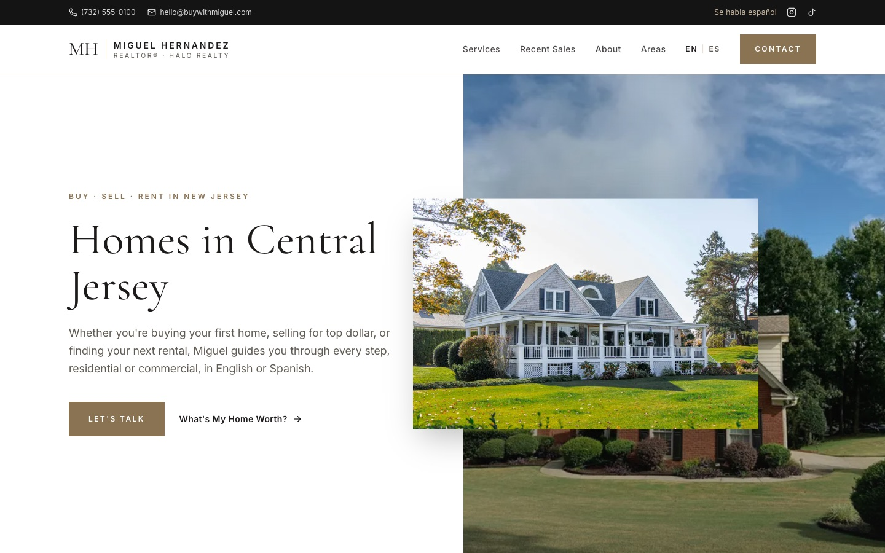
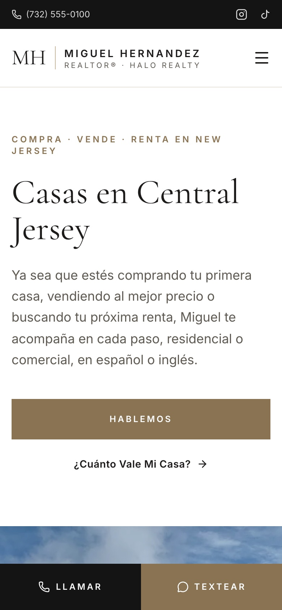

# Buy with Miguel

A bilingual (English / Español) marketing site for **Miguel Hernandez, REALTOR®** with Halo Realty, serving Central New Jersey.

**Live:** [buy-with-miguel.vercel.app](https://buy-with-miguel.vercel.app)

<p>
  
  &nbsp;
  
</p>

## Features

- **Bilingual routing:** `/en` and `/es` pages, statically generated. Visitors are redirected by their browser language.
- **Lead-focused layout:** hero, services, recent sales, about, areas served, and a contact form. Every call to action leads to the form.
- **Contact form:** submissions are emailed via [Web3Forms](https://web3forms.com), with a honeypot for spam and a call/text fallback on error.
- **Mobile call bar:** always-visible Call / Text buttons on phones, since most traffic comes from Instagram and TikTok.
- **NJ advertising compliance:** brokerage name, license number, and Equal Housing Opportunity in the footer.
- **Single source of truth:** contact details, listings, and all copy live in plain data files, so updates don't touch components.

## Tech Stack

- [Next.js 16](https://nextjs.org) (App Router, Server Components, Proxy)
- React 19 + TypeScript
- Tailwind CSS 4
- `next/font` (Cormorant Garamond + Inter) and `next/image`
- Deployed on [Vercel](https://vercel.com)

## Getting Started

```bash
pnpm install
pnpm dev
```

Open [http://localhost:3000](http://localhost:3000).

### Environment Variables

Create `.env.local`:

```bash
# Free key from https://web3forms.com; leads are emailed to the address it's tied to.
NEXT_PUBLIC_WEB3FORMS_KEY=your-access-key
```

## Editing Content

| What                                   | Where                                |
| -------------------------------------- | ------------------------------------ |
| Phone, email, license, headshot, towns | `lib/site.ts`                        |
| Sold & leased properties               | `lib/listings.ts`                    |
| All page copy (English / Spanish)      | `lib/i18n/dictionaries/*.ts`         |
| Colors and fonts                       | `styles/theme.css`, `utils/fonts.ts` |

The Spanish dictionary is typed against the English one, so a missing translation is a type error.

## Project Structure

```
app/[lang]/          Locale-aware layout and page
components/_blocks/  Page sections (header, hero, services, …, footer)
lib/                 Site config, listings, i18n dictionaries
proxy.ts             Redirects / to the visitor's language
```
